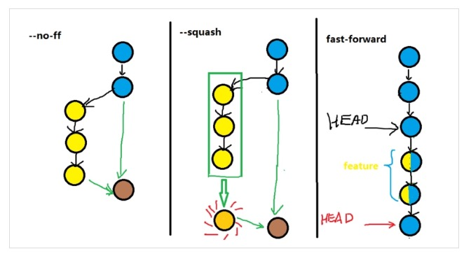
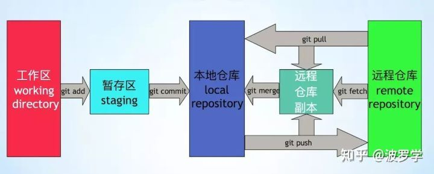

# git

github 搜索技巧

```bash
React.memo extension:tsx stars:>100 filename:tsx
```

## 常用命令

```bash
# 删除文件夹
git rm logs/ -r -f
# 客户端操作
    ➜ /Users/huangrupeng/git >git clone git@rp-master:/usr/local/git/sample.git
# 关联远程git库
git remote add origin git@github.com:michaelliao/learngit.git

## 同步更新fork的远程库
# 先确定是否建立了主repo的远程源
git remote -v
# 如果只看到你自己的两个源(fetch 和 push),那就需要添加主repo的源
git remote add upstream URL
git remote -v
# 想与主repo合并
git fetch upstream
git merge upstream/master

# 初始化 Git 仓库
git init
# 添加文件到暂存区
git add
# 查看当前工作区状态
git status
# 将暂存区文件提交到当前分支
git commit
# 查看提交历史
git log --pretty=oneline --abbrev-commit
git log --graph --pretty=oneline --abbrev-commit
# 丢弃某个文件的修改
git checkout file


## 版本回退
git reset --hard commit_id
# HEAD 是当前版本，HEAD^是上个版本
git reset --hard HEAD\^
# 查看历史命令，便于回到未来的某个版本
git reflog
# 回退完强制推送到远程分支
git push -f
# 自己的分支回滚用 reset，reset 会丢弃某些提交
# 公共分支回滚用 revert，revert 会产生一次新的提交，版本依然是向前的
# 撤销最近一次提交
git revert HEAD


### 创建一个空分支
git checkout --orphan <branchname>
git rm --cached -r .

### 远程分支
# 查看远程分支信息
git remote -v
## 添加多个远程分支
#添加github add后面远程分支的名字随便起
git remote add origin https://github.com/xxx(仓库地址)
#添加oschina
git remote add oschina https://git.oschina.net/xxxx(仓库地址)
#提交到oschina
git push oschina master(分支名)
#提交到github
git push origin master(分支名)
#从oschina更新
git pull oschina master
#从github更新
git pull origin master
#提交所有本地分支到远程 origin 分支
git push --all origin
# 新建远程仓库，将本地仓库关联远程仓库
# fatal: refusing to merge unrelated histories
git pull origin master --allow-unrelated-histories


# A 是远程 repository 名字，B 是本地 branch 名字，C 是远程 branch 名字
# B C 相同时可以省略
git push A B:C
# 意思是将本地分支 master 推送到远程仓库 origin 的 master 分支上
# 所有成员开发 dev 分支，也要与远程仓库保持一致
git push origin master
git push origin dev
# 创建切换 dev 分支
git checkout -b dev
# 切换到 dev 分支
git checkout dev
# 合并指定分支到当前分支
git merge
# 还原工作区，撤销当前目录及子目录下面所有的修改(丢弃工作区的修改)
git checkout -- .
# 撤销 merge 请求
git merge --abort


## 标签
# tag 是一个里程碑，一个标志一个点，branch 是一个新的征程一条线
# tag 就是一个只读的 branch,一般为每一个可发布的里程碑版本打一个 tag
# 创建新的标签
git tag v1.0
# 查看所有标签
git tag
# 从某次提交出打标签
git tag v1.0 commit-id

## Bug 分支
# 将当前工作区修改的内容暂时隐藏起来，并恢复到提交状态
git stash
# 创建 bug 分支
git checkout -b issue-101
# 提交修改
# 切换到 master 分支
git checkout master
# 合并分支
git merge --no-ff -m "merged bug fix 101" issue-10
# 删除分支
git branch -d issue-101
# 删除远程 issue-101 分支
git push origin --delete issus-101
# 查看之前隐藏的内容
git checkout dev
git stash list
# 恢复之前隐藏的内容
git stash pop

## git 忽略已经被提交的文件
# 从 git 库中删除对该文件的追踪
git rm -r --cached xxxx
# 更新 .gitignore 忽略掉目标文件
# git commit -m "We really don't want Git to track this anymore!"

# 丢弃本地修改的所有文件（新增、修改、删除）
git checkout . && git clean -xdf

# 只克隆某个分支
git clone -b v2 https://github.com/ant-design/ant-design-pro.git --depth=1 orz-fe


# 同步 fork 的分支代码
git remote -v
git remote add upstream <remote-repo-url>
git fetch upstream
git merge upstream/master
git push origin master

# 合并特定的 commit 当前分支
git cherry-pick 62ecb3

```

[团队协作](http://www.liaoxuefeng.com/wiki/0013739516305929606dd18361248578c67b8067c8c017b000/0013760174128707b935b0be6fc4fc6ace66c4f15618f8d000)：
**master** 主分支，需要与远程分支同步
**dev** 开发分支，需要与远程分支同步

[创建与合并分支](http://www.liaoxuefeng.com/wiki/0013739516305929606dd18361248578c67b8067c8c017b000/001375840038939c291467cc7c747b1810aab2fb8863508000)

## 问题

### 搭建 git 服务

我在本地的 linux 虚拟机上搭建了一个 git 服务，系统版本为 centos6.5

```bash
# 服务器操作
# 安装git服务
[root@rp-master ~]# yum install git
[root@rp-master ~]# adduser git
[root@rp-master git]# mkdir -p /usr/local/git
# 初始化git仓库
[root@rp-master git]# git init --bare sample.git
Initialized empty Git repository in /usr/local/git/sample.git/
[root@rp-master git]# chown -R git:git sample.git/
# 配置git用户ssh免登录
[root@rp-master git]# cd /home/git/.ssh/
authorized_keys  id_rsa.pub
[root@rp-master .ssh]# cat id_rsa.pub >> authorized_keys
```

### gitlab 工作流

```bash
git clone
git checkout -b $feture_name
git commit -am ''
git push origin $feture_name
review code on commit page
create a merge request
team lead will review code & merge it to main branch
```

### git rebase

rebase 变基，找公共祖先

git rebase，即先找到共同的祖先，然后

```bash
# 合并最近的 4 次提交记录
git rebase -i HEAD~4

# p,pick = use commit 使用当前 commit
# r,reword = 使用当前 commit，但是修改 commit 消息
# e，edit = 使用当前的 commit，stop amending
# s 将当前提交合并到上次的提交

# 将四次提交合并成一次
s cacc52da add: qrcode
s f072ef48 update: indexeddb hack
s 4e84901a feat: add indexedDB floder
p 8f33126c feat: add test2.js

git checkout feature1
# 如果当前分支有 master 分支的最新提交，则会直接 merge
# 如果 master 分支比当前分支新，则会添加一个新的 commit
git merge master
# 1. git 把feature1分支的每个 comit 取消掉
# 2. 把上面的临时操作保存成 patch 文件，存在 .git/rebase 目录下
# 3. 将 feature1 分支更新到最新的 master 分支
# 4. 把 patch 文件应用到 feature1 分支下
git rebase master

# rebase 出现冲突，git 会停止 rebase 并让你解决冲突，解决完冲突后，用 git add 更新
# 1. 修改冲突部分
# 2. 如下 (不要 git commit)
git add
# 3. 如下
git rebase --continue
# 4. 如果第三部无效，可以执行 git rebase --skip


# 取消 rebase，回到开始前的状态
git rebase -abort


# --no-ff Git执行"快进式合并"（fast-farward merge），会直接将Master分支指向Develop分支。
# 使用--no-ff参数后，会执行正常合并，在Master分支上生成一个新节点。
git merge --no-ff develop

```



```bash
# 保留分支提交记录，同时会生成一个新的 commit 记录
git merge --no-ff -m "mege with no-ff" develop
# 将多次分支 commit 历史压缩为一次
git merge --squash develop
# 快进式合并，直接将 HEAD 指针指向合并分支的头，删除分支，则会丢失分支信息
git merge develop
```

## git pull 和 git fetch 的区别



pull=fetch+merge 可以帮助理解这一点，但严格意义上来讲，pull≠fetch+merge

git fetch 并没更改本地仓库的代码，只是拉取了远程 commit 数据，将远程仓库的 commit id 更新为 latest。
./git/refs 里面有三个文件夹：heads、remotes、tags。

## git reset --soft,--hard 的区别

- `HEAD` 当前分支当前版本的游标
- `Index` 暂存区，修改一个文件，最开始是 unstaged 状态，`git add` 提交这些修改之后会加入到 index，称为 staged 状态， commit 时，index 里面的修改会提交
- working tree` 当前的工作目录

- `--soft` 仅仅重置 HEAD 到指定的版本，不会修改 index 和 working tree，也就是重置到 add 之后的状态
- `--mixed` 重置到 add 之前的状态
- `--hard` 重置到上次提交之前的状态，且修改无法找回

## git 提交规范

```bash
<type>(<scope>): <subject>
```

type 有如下这些：

- feat：新功能（feature）
- fix：修补 bug
- docs：文档（documentation）
- style： 格式（不影响代码运行的变动）
- refactor：重构（即不是新增功能，也不是修改 bug 的代码变动）
- test：增加测试
- chore：构建过程或辅助工具的变动

scope 用于说明 commit 影响的范围

subject 用于 commit 的简短描述

1. 以动词开头
2. 第一个字母小写
3. 结尾不加句号


## 参考

[远程仓库版本回退方法](https://blog.csdn.net/fuchaosz/article/details/52170105)
[commit message 和 change log](http://www.ruanyifeng.com/blog/2016/01/commit_message_change_log.html)
[git merge 和 rebase 的区别](https://www.jianshu.com/p/f23f72251abc)
