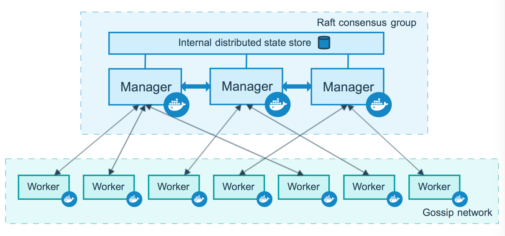
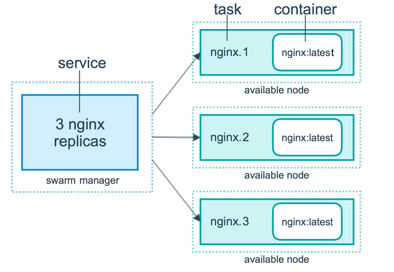
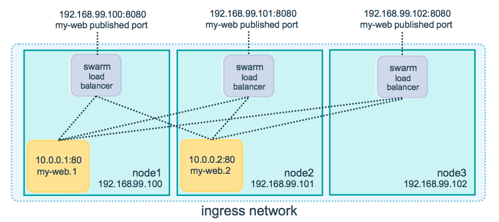

# docker 集群

## docker swarm 介绍

节点分为 manager 节点和 worker 节点

- 集群如何工作：
  - 
  - **管理节点**，用于 swarm 集群的管理，可以有多个管理节点，只有一个 leader 节点，Raft 算法实现，可以单节点运行 manager，但是当该节点失败时，管理的服务可以继续运行，但是恢复需要创建新的集群。最好创建单数个节点来保证高可用，N manager 的集群最多允许 (N-1)/2 个 manager 失败。docker 推荐一个集群最多 7 个管理节点。
    - 维护集群状态
    - 服务调度
    - 维护 swarm 模式的 HTTP API endpoints
  - **工作节点**，默认情况下，所有的管理节点也是工作节点
- 服务如何工作：
  - 
  - 创建一个服务通常还需要额外定义如下选项
    - 端口，允许服务被外界访问
    - overlay 网络，允许 swarm 里面的服务之间
    - CPU、memory
    - 回滚更新策略
    - 服务副本数（service replicas)
  - 服务通常有两种模式
    - Replicated，定义任务数量，分配到每个节点，服务失败会会自动重新创建
    - global，每个节点运行一个任务
- 部署服务到 swarm

  - 通过私服镜像创建服务

    ```bash
    # 登录私服
    docker login registry.example.com
    docker service  create \
    --with-registry-auth \
    --name my_service \
    registry.example.com/acme/my_image:latest
    ```

  - 更新服务

    ```bash
    # 添加服务端口
    docker service update --publish-add 80 my_web
    ```

- swarm 使用 compose 部署服务，主要使用 [docker stack](https://docs.docker.com/engine/reference/commandline/stack/)

  ```bash
  # 部署或者更新 stack
  # -c 指定 compose file
  # 修改 compose file 再次执行可以 redeploy，无需停止当前服务
  docker stack deploy [OPTIONS] STACK
  docker stack ls
  docker stack ps
  docker stack rm
  docker stack services
  # 删除应用
  docker stack rm STACK
  ```

## swarm mode 常用命令

```bash
## swarm 管理
# 只能在管理节点执行
docker swarm
# 查看 join toker
docker swarm join-token -q worker
# 可以在工作节点执行
docker swarm leave --force
# swarm 初始化 默认创建的是管理节点，通过 join 命令加入工作节点
docker swarm init
[root@localhost ~]# docker swarm init --advertise-addr 10.24.10.82
Swarm initialized: current node (u4tksst5ejv90bvojnpkl19ic) is now a manager.

To add a worker to this swarm, run the following command:

    docker swarm join --token SWMTKN-1-526vxe7y7hmtl7itzlknjw6ox71bu8bpo6omia4shxazxic5dc-1yt5c07ntjecr5p3r2xeieprg 10.24.10.82:2377

To add a manager to this swarm, run 'docker swarm join-token manager' and follow the instructions.

# 限制 task 的 history 数量
# 默认值是 5，如果多次执行 docker service update，会在 docker service ps 里面看到每个 Running 状态的 task 会对应 4 个 Shutdown 状态的task
docker swarm update --task-history-limit 1


# 查看 docker 节点状态
docker node ls
# 删除 docker node
docker node rm <node id>
# 查看当前 node 节点状态
docker node inspect self --pretty
# 添加 label
docker node update --label-add foo --label-add bar=baz node-1
```

### [docker service](https://docs.docker.com/engine/reference/commandline/service_create/)

`docker service` vs `docker stack` 和类似于 `docker run` vs `docker compose`

```bash
# 创建一个 nginx 集群，复制三个节点，暴露端口 80
docker service create --replicas 3 -p 80:80 --name nginx-cluster nginx:1.13.7-alpine
# 查看服务状态
docker service ps nginx-cluster
# 查看服务详细信息
docker service inspect --pretty nginx-cluster
# 服务扩容 将 task 扩展为 5 个
docker service scale nginx-cluster=5
# 删除服务
docker service rm nginx-cluster
# 查看服务日志 默认显示所有的日志 -
# -tail 从日志结尾开始显示多少行
# --since 从指定时间戳开始的日志 1m30s 3h
docker service logs -f --tail 100 nginx-cluster

# Roll back to the previous version of a service
# docker service create，每次执行 docker service update 都会创建一个新的版本
docker service rollback nginx-cluster


# 创建服务 设置更新延迟
# --replicas 复制模式
# --mode global 全局模式，每个 node 上将起一个 task 任务
# --reserve-memory --reserve-cpu 指定内存和 cpu
# --constraint node.labels.region==east \
docker service create \
  --replicas 3 \ # 创建几个实例
  --name redis \
  --update-delay 10s \ # 更新延迟 s/m/h 也可以 10m2s
  --update-parallelism 2 \ # 同时更新数量
  --update-failure-action continue \ # 更新失败策略
  --rollback # 更新失败回滚 可以设置 rollback 参数
  redis:3.0.6
# 更新服务 使用新的 redis 版本
# 1.停止第一个任务 2.更新停止的任务 3.启动更新的任务 4.如果任务启动成功(running),等待 update-delay 时间之后，启动下一个任务 5.更新过程中出现任何 FALIED，则停止更新
# --publish-add 更新服务，添加端口
# --publish-rm  更新服务，删除端口
# --image swarm manager 会去 registry 拉取最新的镜像并且更新 service task
# 所有的 worker 对应的 task 也会更新 1、如果对应版本的 image 的 digest 存在，则直接更新 2、如果不存在则去 registry 拉取再更新，拉取失败，会通知 manager，manager 会将任务分配到其他的 node
docker service update --image redis:3.0.7 redis
# 查看所有节点
docker node
# 将节点设置为 drain 的状态，该节点将不接收新的任务，已有的任务将转移到其他 active 状态的节点
docker node update --availability drain worker1
# 为服务添加新的端口
docker service update \
  --publish-add published=<PUBLISHED-PORT>,target=<CONTAINER-PORT> \
  <SERVICE>

# routing mesh
# 在任意节点上访问 8080端口，docker 将你的请求路由到一个 active 的container
# -p 是 --public published=<PUBLISHED-PORT>,target=<CONTAINER-PORT>的缩写
# 暴露 PUBLISHED-PORT 端口之后，内部其实是映射到一个随机的 high-numbered 端口
docker service create --name my-web -p 8080:80 --replicas 2 nginx
# 更新服务，暴露新的端口
docker service update --publish-add 8081:80 my-web
# 此时旧的端口依然存在，删除旧的端口
docker service update --public-rm
# 可以配置外置 负载均衡器，如 HAProxy
# https://docs.docker.com/engine/swarm/ingress/#configure-an-external-load-balancer

# 部署服务到 swarm
# 使用声明式（即命令行）可以指定如下参数（不仅限于）
# 镜像 容器复制个数 暴露端口 是否随docker启动而启动 等等
# service 常见操作
# https://docs.docker.com/engine/swarm/services/#create-a-service-using-an-image-on-a-private-registry

# replicated or global services
# --mode global 每个节点上面创建一个任务
# --reserve-memory/--reserve-cpu 为服务分配内存和 cpu
# --constraint node.labels.region==east  只在指定的 node 上面创建 service task，创建 swarm node 时可以指定 label，为 key=value 的形式、

# rollback 策略
# --rollback-delay Amount of time to wait after rolling back a task before rolling back the next one. 0表示第二个任务立即回滚
# --rollback-failure-action pause/continue 一个任务 rollback 失败，是继续 rollback 其他任务还是暂停
# --rollback-max-failure-ratio 0-1 如设置 .2，有五个任务，最多容忍 1 个任务回滚失败
# --rollback-monitor
# --rollback-parallelism 最大 rollback 并行数
# 下面这段命令表示，创建五个任务，当执行 docker service update 部署失败时，两个任务并行回滚，任务被监控 20s确保回滚没有退出，能忍受最多 5 * 0.2 = 1 个任务回滚失败。
docker service create --name=my_redis \
                        --replicas=5 \
                        --rollback-parallelism=2 \
                        --rollback-monitor=20s \
                        --rollback-max-failure-ratio=.2 \
                        redis:latest

# 访问卷
# 创建服务通过--mount  更新服务通过 --mount-add --mount-rm
# type=volume 和 type=bind 两种方式，第一种使用卷，第二种使用主机目录
#  --mount type=volume,src=<HOST-PATH>,dst=<CONTAINER-PATH> 推荐使用 volume 的方式
# 但是每个 node 都得创建 volume，service 在多个 node 上面的 task 能否共享 volume 呢？可以使用 nfs
```

### docker stack

```bash
# 通过 compose 文件来创建/更新 docker service
docker stack deploy -c bb-stack.yaml demo

docker stack ls

docker stack ps

docker stack services demo
```

## network



## 通过 docker config 保存配置数据

## practice

```bash

```

## 参考

[raft 算法图解](http://thesecretlivesofdata.com/raft/)

[在 swarm 上部署服务](https://docs.docker.com/engine/swarm/services/)

[docker-compose](https://docs.docker.com/compose/install/#install-compose)

[Dockerfile reference](https://docs.docker.com/engine/reference/builder/)

[Docker cli](https://docs.docker.com/engine/reference/run/)

[compose-file](https://docs.docker.com/compose/compose-file/)

## 疑问

什么是 overlay network

## 备注

docker
