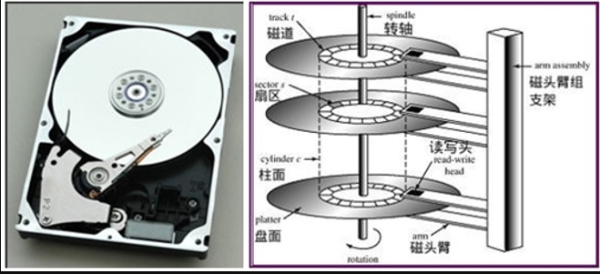
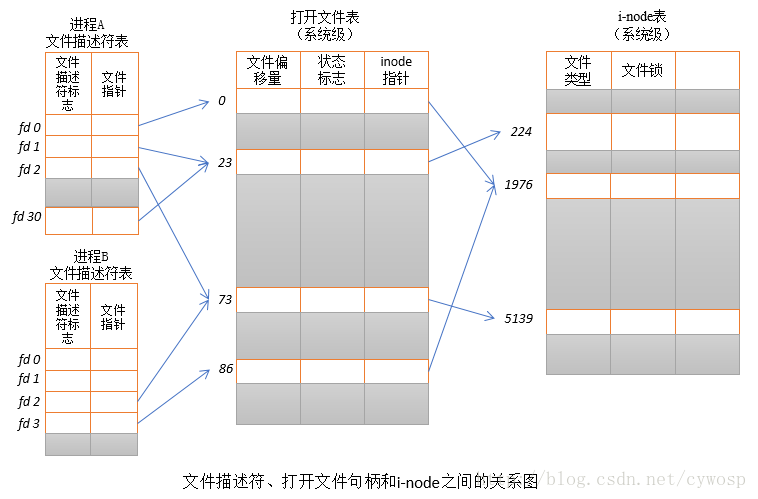

本文主要介绍了，磁盘的物理结构，文件描述符和 linux 的目录结构。

## 磁盘物理结构

磁盘物理结构及 IO 时的过程



- 磁**盘面**，磁盘由一叠磁盘面组成，每个盘面对应一个磁头
- **磁道**(Track)，每个盘面会围绕圆心划分多个同心圆，两个圆圈之间是一个磁道
- **柱面**(cylinders)，所有磁盘同一位置的磁道组成的圆柱体叫柱面
- **扇区**(Sector)，每个磁道划分成多个扇区，如计算磁盘总大小：255 盘面 \* 145847 柱面 \* 63 扇区 \* 每个扇区 512bytes =1199632412160 byte=1117.25GB，文件在硬盘最小存储单位叫“扇区（Sector 512Byte）”，多个扇区组成“**块（block）**”，通常由 **8 个 Sector 组成一个 block**，**操作系统读取硬盘通常按块读取**。文件数据都存储在“块”里，文件的元信息（创建者，创建日期，大小...）存储在 inode 里面，即“**索引节点**”。用户通过文件名打开文件，实际是，系统通过文件名找到 inode 号码，获取 inode 信息，从而找到文件数据所在的 block。目录文件如果只有读权限，只能获取文件名，其他信息都存储在 inode 里面，读取 inode 信息需要具有执行权限`x`可以通过 **stat** 查看文件 inode 信息
  - 第一步，首先是磁头径向移动来寻找数据所在的磁道。这部分时间叫寻道时间。
  - 第二步，找到目标磁道后通过盘面旋转，将目标扇区移动到磁头的正下方。
  - 第三步，向目标扇区读取或者写入数据。到此为止，一次磁盘 IO 完成。
  - 故：单次磁盘 IO 时间 = 寻道时间 + 旋转延迟 + 存取时间
- 假设磁盘由 400 个柱面，共分为 4 个分区，第四个分区在 301-400 柱面范围
- 多个磁盘，/dev/sba /dev/sdb 命名
- 同个磁盘，多个分区 dev/sda1 /dev/sda2 命名，
- 硬盘的第一个扇区记录`主要开机记录区MBR（安装开机记录程序）`,446Bytes,`分区表（记录硬盘分区状态）`，分区表有 64Bytes，每个分区表项长 16 Bytes，所以只能最多有四个分区，主分区（primary）和延伸分区`Extended`，分区的最小单位是柱面，主分区和延伸分区最多可以有四个(硬盘的限制)，延伸分区最多只能有一个（操作系统限制），逻辑分区是延伸分区持续切割出来的分区，主分区和逻辑分区能够格式化，延伸分区无法格式化，主分区和逻辑分区用来存储数据，分区的`/sdb4`这个是延伸分区，提供给逻辑分区创建之用，逻辑分区是从`/dev/sdb5`开始。硬盘格式化之后分为两个区域，一个是数据区，存放文件数据，一个是 inode 区（inode table）存放 inode 包含的信息。
- 

```bash
# 查看硬盘分区每个Inode大小
# Block size 查看Block的大小
[root@rp-master ~]# dumpe2fs -h /dev/sda1 | grep "Inode size"
dumpe2fs 1.41.12 (17-May-2010)
Inode size:	          128
# 查看文件inode信息 inode里面没有文件名
#包括文件字节数、拥有者 ID、GroupId、读写执行权限、时间挫、链接数、block 位置
[root@vmcentos00 data]# stat unzip-file.sh
  File: "unzip-file.sh"
  Size: 1273      	Blocks: 8          IO Block: 4096   普通文件
Device: 811h/2065d	Inode: 14          Links: 1
Access: (0777/-rwxrwxrwx)  Uid: (    0/    root)   Gid: (    0/    root)
Access: 2016-08-08 09:02:52.967273201 +0800
Modify: 2016-08-05 15:38:02.286273201 +0800
Change: 2016-08-05 15:38:02.292273201 +0800
# 查看每个硬盘分区inode总数和已经使用的数量
# df -l 查看数据区
[root@vmcentos00 data]# df -i
Filesystem        Inodes   IUsed     IFree IUse% Mounted on
/dev/sda3        3473408  215599   3257809    7% /
tmpfs            4109318       2   4109316    1% /dev/shm
/dev/sda1          51200      39     51161    1% /boot
/dev/sdb1      134217728 1854559 132363169    2% /data
# 查看文件inode号码
[root@vmcentos00 data]# ls -i unzip-file.sh
14 unzip-file.sh
# 查看目录文件详细信息
[root@vmcentos00 data]# ls -l /data
总用量 6976
drwxr-xr-x 19 root root    4096 7月  29 11:21 006
drwx------  2 root root   16384 8月   2 08:58 lost+found
-rw-r--r--  1 root root 4868927 8月   8 10:16 sincedb_request
-rw-r--r--  1 root root 2241556 8月   8 10:16 sincedb_syscode
-rwxrwxrwx  1 root root    1273 8月   5 15:38 unzip-file.sh
drwxr-xr-x 12 root root    4096 8月   8 10:16 xmls
[root@vmcentos00 ~]# fdisk -l
# 可以看出每个扇区大小是512byte
Units = cylinders of 16065 * 512 = 8225280 bytes
```

## fd 文件描述符

linux 系统中一切可以看成文件，普通文件、目录文件、链接文件和设备文件。文件描述符（file descriptor）是内核为了高效管理已经打开的文件创建的索引。程序刚启动，0 是标准输入，1 是标准输出，2 是标准错误，如果此时新打开一个文件，文件描述符是 3。
文件描述符是一个非负整数，它是一个索引值，指向内核为每一个进程锁维护该进程打开文件的记录表。

> On a UNIX system, everying is a file; if something is not a file, it is a process.



文件描述符是一个非负整数。
进程 A 中，文件描述符 1 和 30 都打开了同一个文件，比如对同一个文件使用 dup 函数。
进程 A 的文件描述符 2 和进程 B 的文件描述符 2 都指向了同一个打开的文件句柄，这种情形可能是在调用 fork() （A、B 是父子进程）之后出现的。
进程 A 的文件描述符 0 和进程 B 的文件描述符 3 指向不同的文件句柄，但是缺指向同一个文件。可能是每个进程对同一个文件发起 open 调用

不同的文件类型(`ls -lh` 输出的最左边就是文件类型)

| Symbol | Meaning      | 解释                                   |
| ------ | ------------ | -------------------------------------- |
| -      | Regular file | 普通文件，如文本文件，可执行文件或程序 |
| d      | Directory    | 目录文件                               |
| l      | Link         | 链接文件                               |
| c      | Special file |                                        |
| s      | Socket       |                                        |
| p      | Named pipe   |                                        |
| b      | Block device |                                        |

### 链接文件

- **硬链接** 多个文件名指向同一个 inode 号码，删除一个文件名，不影响另一个文件名使用。
  `ln 源文件 目标文件`
- **软连接** 文件 A 的内容是文件 B 的路径，文件 A 称为文件 B 的软连接，A，B inode 号码不同（A 是一个单独的文件），删除 B，A 将提示没有文件或目录
  `ln -s 源文件或目录 目标文件或目录`

```bash
➜ /Users/huangrupeng >ll /usr/local/bin/hexo
lrwxr-xr-x  1 huangrupeng  admin    37B  6  2 09:05 /usr/local/bin/hexo -> ../lib/node_modules/hexo-cli/bin/hexo
```

### lsof 命令

lsof(list of open files)，列出当前系统打开文件的工具，进程打开的文件描述符列表提供了大量关于这个应用程序的信息，可以通过 lsof 来进行系统监测。

| COMMAND  | PID        | USER       | FD         | TYPE     | DEVICE   | SIZE/OFF | NODE     | NAME         |
| -------- | ---------- | ---------- | ---------- | -------- | -------- | -------- | -------- | ------------ |
| 进程名称 | 进程标识符 | 进程所有者 | 文件描述符 | 文件类型 | 磁盘名称 | 文件大小 | 索引节点 | 文件确切名称 |

```bash
# 查看进程占用端口情况
lsof -i -n

# 列出当前系统打开的所有文件
# 文件可以是普通文件、目录、网络文件系统的文件、网络文件(如 socket)、符号链接等

# 查看进程号 21896 占用的端口 -P
# -a 多个指令用且的关系(默认是或)
# -P 不要将网络文件的端口号转化为名字
# -n 不要将网络文件的网络号转化为名字
# -i 列出所有的网络连接
# -t 只列出进程号
lsof -Pan -p 21896 -i
# 列出所有监听端口
lsof -Pnl +M -i4
# 列出使用80端口的进程
lsof -i TCP:80
lsof -i :80
# 列出所有使用指定文件、目录的进程
lsof </path/to/file>
# 列出指定用户的所有进程
lsof -u <username>
# List all files/network connections a given process is using
lsof -c <command-name>
# 指定端口号是否处于监听状态
lsof -Pi :80 -sTCP:LISTEN -t
```

```bash
# 查看系统级别最大打开文件数 /proc/sys/fs/file-max
[root@vmcentos00 data]# sysctl -a|grep fs.file-max
fs.file-max = 3265080
# 查看单个进程最大打开文件数
[root@vmcentos00 data]# ulimit -n
1024
# 修改最大文件打开数
[root@vmcentos00 data]# vim /etc/security/limits.conf
# 添加下面两行
*  soft    nofile          65535
*  hard   nofile          65535
# 系统登录后，应该调用pam_limits.so模块来设置系统对该用户可使用的各种资源数量的最大限制
# 64位的系统是/lib64否则是/lib
[root@vmcentos00 ~]# echo session    required     /lib64/security/pam_limits.so >> /etc/pam.d/login
# 重启系统
```

## 文件系统

```bash
/           根目录
├── bin     必须命令的二进制文件
├── boot    存放内核引导配置文件
├── dev     存放设备文件
├── etc     存放系统配置文件
├── home    用户主目录
├── lib     动态共享库
├── lost+found 	文件系统恢复时的恢复文件
├── media   可卸载存储介质挂载点
├── mnt     文件系统临时挂载点
├── opt     外部应用程序软件包
├── proc    系统内存的映射目录，提供内核与进程信息  包含系统资源的虚拟文件系统
├── root    root 用户主目录
├── sbin    存放系统二进制文件
├── srv     存放服务相关数据
├── sys     sys 虚拟文件系统挂载点
├── tmp     存放临时文件
├── usr     存放用户应用程序
├── var     存放邮件、系统日志等变化文件
|   └─ lib 保存应用程序或系统的状态信息
└─────
```

### proc

proc 虚拟文件系统。

> /proc 目录下面常见文件

- `/proc/cpuinfo` 处理器相关信息文件
- `/proc/version` 系统运行内核版本号
- `/proc/...` 其他我用的都比较少，以后有应用场景了再补充

> 进程目录下的常见文件

proc 目录中由**数字命名的子目录**，这些**表示当前正在运行的进程号**，里面包含进程相关的文件，主要有：

- `cmdline` 启动当前进程的完整命令
- `cwd` 指向当前进程运行目录的符号链接
- `environ` 当前进程的环境变量列表
- `exe` 指向当前进程可执行文件的符号链接
- `fd` 当前进程打开的每一个文件的文件描述符
- `limits` 当前进程使用的资源限制
- `status` 与 stat 提供的信息类似，当前进程的详细信息
- `statm` 当前进程占用内存状态信息
- `task` 目录文件，当前进程运行的每一个线程的相关信息，每个线程的相关信息保存在一个由线程号命名的目录中

下面是我的一个运行在 7003 端口 go 程序

```bash
# 根据端口找到进程号
[root@localhost 17480]# lsof -i:7003 -anP
COMMAND   PID USER   FD   TYPE    DEVICE SIZE/OFF NODE NAME
main    17480 root    6u  IPv6 669347315      0t0  TCP *:7003 (LISTEN)
[root@localhost 17480]# pwd
/proc/17480
# 查看当前进程的 lsof 信息
[root@localhost 17480]# lsof -p 17480 -anP
COMMAND   PID USER   FD      TYPE    DEVICE SIZE/OFF     NODE NAME
main    17480 root  cwd       DIR       8,3     4096 29887827 /srv/edc/bin
main    17480 root  rtd       DIR       8,3     4096        2 /
main    17480 root  txt       REG       8,3 15913280 29887813 /srv/edc/bin/main
main    17480 root    0w      CHR       1,3      0t0     1028 /dev/null
main    17480 root    1w      REG       8,3  3321639 29887819 /srv/edc/bin/nohup.out
main    17480 root    2w      REG       8,3  3321639 29887819 /srv/edc/bin/nohup.out
main    17480 root    3u     IPv4 677357886      0t0      TCP 10.24.10.82:51608->10.24.10.82:3306 (ESTABLISHED)
main    17480 root    4u  a_inode      0,10        0     8318 [eventpoll]
main    17480 root    6u     IPv6 669347315      0t0      TCP *:7003 (LISTEN)
main    17480 root    9u     IPv4 678946119      0t0      TCP 127.0.0.1:39330->127.0.0.1:6379 (ESTABLISHED)
main    17480 root   10u     IPv4 677362834      0t0      TCP 10.24.10.82:51646->10.24.10.82:3306 (ESTABLISHED)
[root@localhost 17480]# ls
attr       cgroup      comm             cwd      fd       io        map_files  mountinfo   net        oom_adj        pagemap      projid_map  schedstat  smaps  statm    task     wchan
autogroup  clear_refs  coredump_filter  environ  fdinfo   limits    maps       mounts      ns         oom_score      patch_state  root        sessionid  stack  status   timers
auxv       cmdline     cpuset           exe      gid_map  loginuid  mem        mountstats  numa_maps  oom_score_adj  personality  sched       setgroups  stat   syscall  uid_map
[root@localhost 17480]#
```

### /dev/shm

该目录不在硬盘上，而是在内存里，默认大小；是内存的一半

```bash
[root@localhost ~]# df -lh|grep /dev/shm
tmpfs            16G     0   16G    0% /dev/shm
```

## 参考

[General overview of the Linux file system](http://www.tldp.org/LDP/intro-linux/html/sect_03_01.html)

[理解 inode](http://www.ruanyifeng.com/blog/2011/12/inode.html)

[磁盘物理结构及 IO 时的过程](http://www.linuxidc.com/Linux/2015-04/116419.htm)

[磁盘分区](https://wizardforcel.gitbooks.io/vbird-linux-basic-4e/content/20.html)

[每天进步一点点——Linux 中的文件描述符与打开文件之间的关系](http://blog.csdn.net/cywosp/article/details/38965239)
